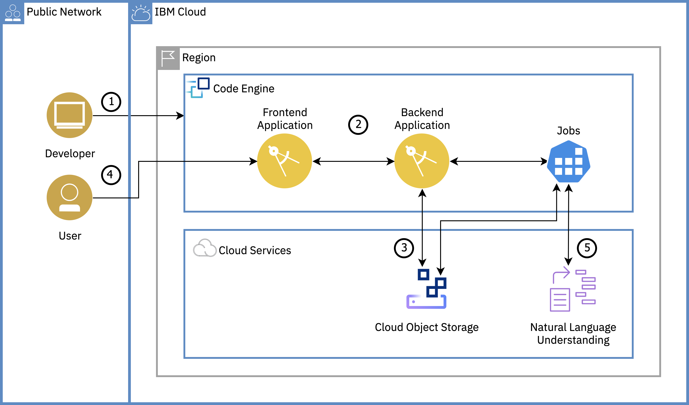

# Welcome to our IBM Cloud Code Engine Workshop

In this tutorial, you will learn about IBM Cloud™ Code Engine by deploying a text analysis with Natural Language Understanding application. You will create a Code Engine project, select the project and deploy Code Engine entities - applications and jobs - to the project. You will learn how to bind IBM Cloud services to your Code Engine entities. You will also understand the auto-scaling capability of Code Engine where instances are scaled up or down \(to zero\) based on incoming workload. This is a simplified version of the IBM Cloud Solution Tutorial for Code Engine. [https://cloud.ibm.com/docs/solution-tutorials?topic=solution-tutorials-text-analysis-code-engine\#text-analysis-code-engine-0](https://cloud.ibm.com/docs/solution-tutorials?topic=solution-tutorials-text-analysis-code-engine#text-analysis-code-engine-0)

